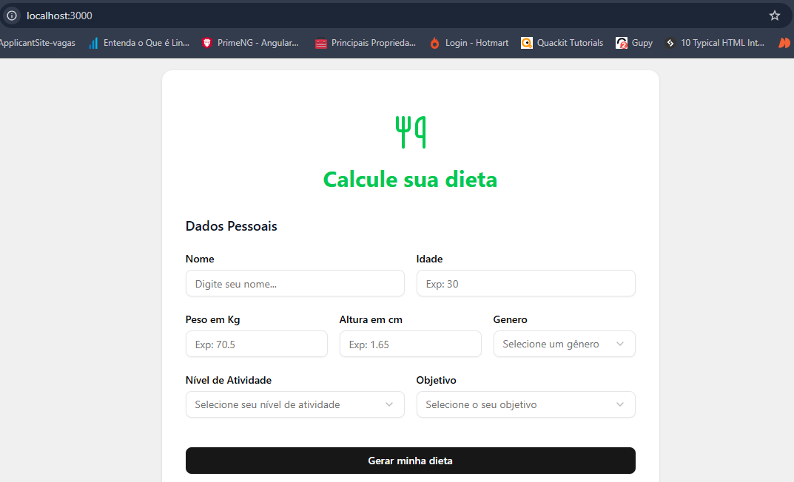
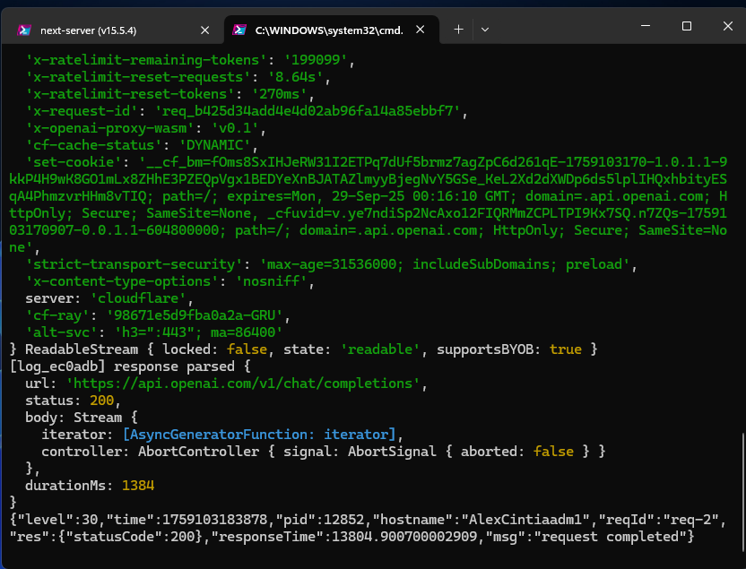
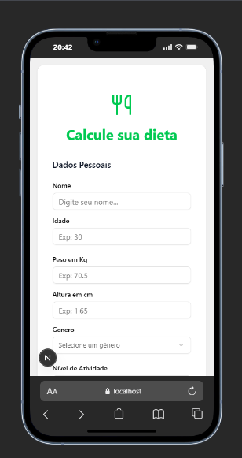
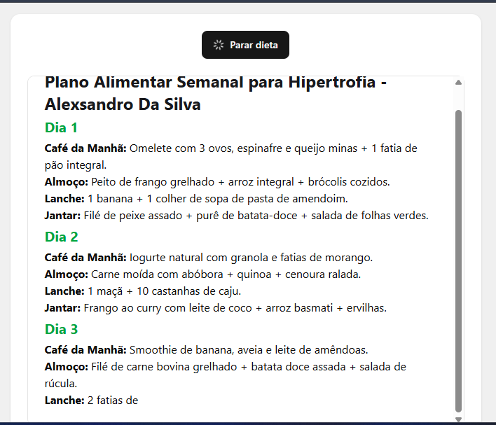

# 🥗 Dieta Project

Um sistema inteligente para geração de planos de dieta personalizados usando IA, desenvolvido com Next.js e Node.js.



## 🚀 Sobre o Projeto

O **Dieta Project** é uma aplicação web que utiliza inteligência artificial para gerar planos de dieta personalizados baseados nas informações do usuário. O sistema coleta dados como peso, altura, nível de atividade física e objetivos, processa essas informações e retorna um plano de dieta completo de 7 dias.

## ✨ Funcionalidades

- 📝 **Formulário Inteligente**: Coleta informações detalhadas do usuário
- 🤖 **IA Integrada**: Utiliza OpenAI para gerar planos personalizados
- 📱 **Design Responsivo**: Interface mobile-first e moderna
- ⚡ **Performance**: Backend otimizado com Fastify
- 🎨 **UI/UX**: Interface limpa e intuitiva com Tailwind CSS

## 🏗️ Arquitetura



O projeto é dividido em duas partes principais:

### Backend (API)
- **Framework**: Node.js com Fastify
- **Linguagem**: TypeScript
- **IA**: OpenAI GPT para geração de dietas
- **Validação**: Zod para validação de dados
- **CORS**: Configurado para comunicação com frontend

### Frontend (Web)
- **Framework**: Next.js 15 com React 19
- **Estilização**: Tailwind CSS
- **Componentes**: Radix UI + shadcn/ui
- **Formulários**: React Hook Form com validação
- **Design**: Mobile-first e responsivo

## 🛠️ Tecnologias Utilizadas

### Backend
- Node.js
- TypeScript
- Fastify
- OpenAI API
- Zod
- tsx (desenvolvimento)

### Frontend
- Next.js 15
- React 19
- TypeScript
- Tailwind CSS
- Radix UI
- React Hook Form
- Lucide React (ícones)

## 📦 Instalação e Configuração

### Pré-requisitos
- Node.js (versão 18 ou superior)
- npm ou yarn
- Chave da API OpenAI

### 1. Clone o repositório
```bash
git clone https://github.com/seu-usuario/dieta-project.git
cd dieta-project
```

### 2. Configure o Backend
```bash
cd backend
npm install
```

Crie um arquivo `.env` na pasta backend com:
```env
OPENAI_API_KEY=sua_chave_da_openai_aqui
```

### 3. Configure o Frontend
```bash
cd ../web
npm install
```

### 4. Execute o projeto

**Backend:**
```bash
cd backend
npm run dev
```

**Frontend:**
```bash
cd web
npm run dev
```

O backend estará rodando em `http://localhost:3001` e o frontend em `http://localhost:3000`.

## 🎯 Como Usar



1. **Acesse a aplicação** no navegador
2. **Preencha o formulário** com suas informações:
   - Nome
   - Peso
   - Altura
   - Nível de atividade física
   - Objetivos
3. **Clique em gerar** e aguarde o processamento
4. **Visualize seu plano** de dieta personalizado de 7 dias

## 🤖 IA e Processamento



O sistema utiliza a API da OpenAI para:
- Analisar as informações do usuário
- Considerar objetivos e restrições
- Gerar um plano nutricional balanceado
- Criar refeições variadas e saudáveis
- Fornecer orientações personalizadas

## 📱 Design Responsivo

A aplicação foi desenvolvida com foco em **mobile-first**, garantindo uma experiência otimizada em todos os dispositivos:

- 📱 **Mobile**: Interface adaptada para smartphones
- 💻 **Desktop**: Layout expandido para telas maiores
- 🎨 **Design System**: Componentes consistentes e reutilizáveis

## 🚀 Deploy

### Backend
O backend pode ser deployado em plataformas como:
- Vercel
- Railway
- Heroku
- DigitalOcean

### Frontend
O frontend Next.js pode ser deployado em:
- Vercel (recomendado)
- Netlify
- AWS Amplify

## 📁 Estrutura do Projeto

```
dieta-project/
├── backend/                 # API Node.js
│   ├── src/
│   │   ├── agent.ts        # Configuração da IA
│   │   ├── server.ts       # Servidor Fastify
│   │   ├── routes/         # Rotas da API
│   │   └── types.ts        # Tipos TypeScript
│   └── knowledge/          # Conhecimento base
├── web/                    # Frontend Next.js
│   ├── src/
│   │   ├── app/           # App Router
│   │   ├── components/    # Componentes UI
│   │   ├── _components/   # Componentes específicos
│   │   └── types/         # Tipos TypeScript
│   └── public/            # Assets estáticos
└── README.md
```

## 🤝 Contribuição

Contribuições são bem-vindas! Para contribuir:

1. Fork o projeto
2. Crie uma branch para sua feature (`git checkout -b feature/AmazingFeature`)
3. Commit suas mudanças (`git commit -m 'Add some AmazingFeature'`)
4. Push para a branch (`git push origin feature/AmazingFeature`)
5. Abra um Pull Request

## 📄 Licença

Este projeto está sob a licença ISC. Veja o arquivo `LICENSE` para mais detalhes.

## 👨‍💻 Autor

Desenvolvido com ❤️ para ajudar pessoas a terem uma alimentação mais saudável e personalizada.

---

⭐ **Se este projeto te ajudou, não esqueça de dar uma estrela!**
